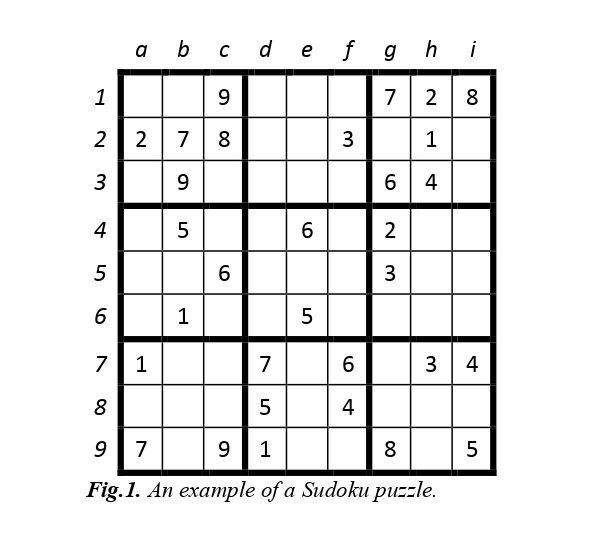
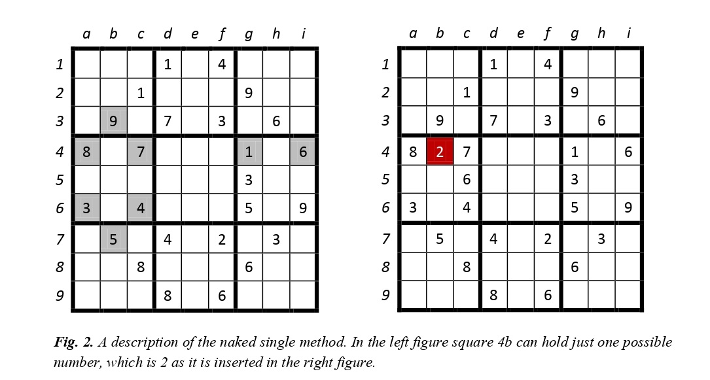
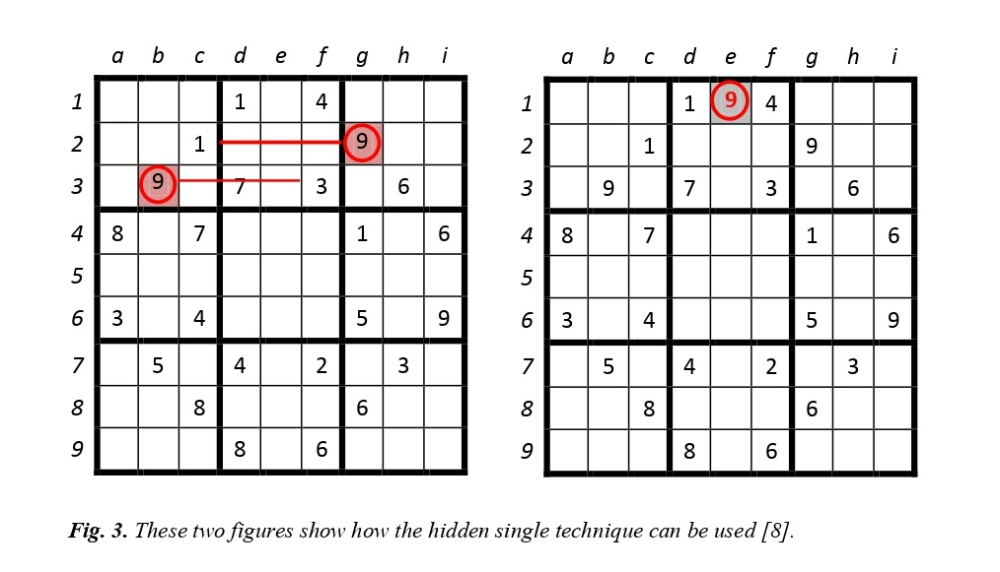
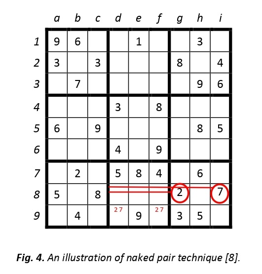
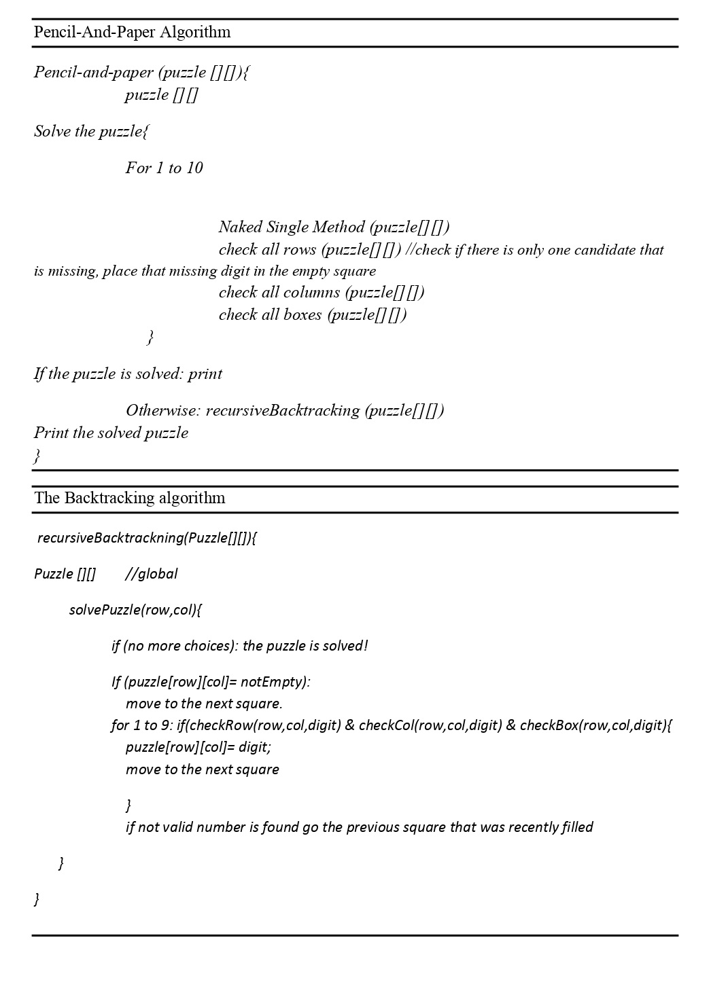
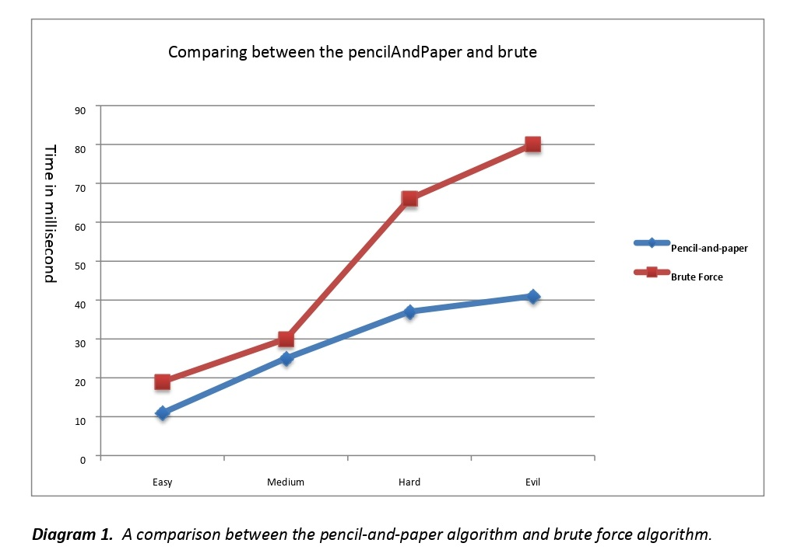
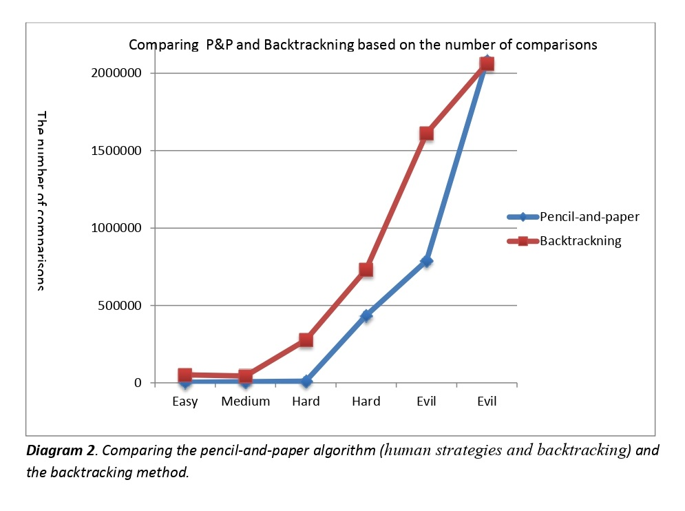
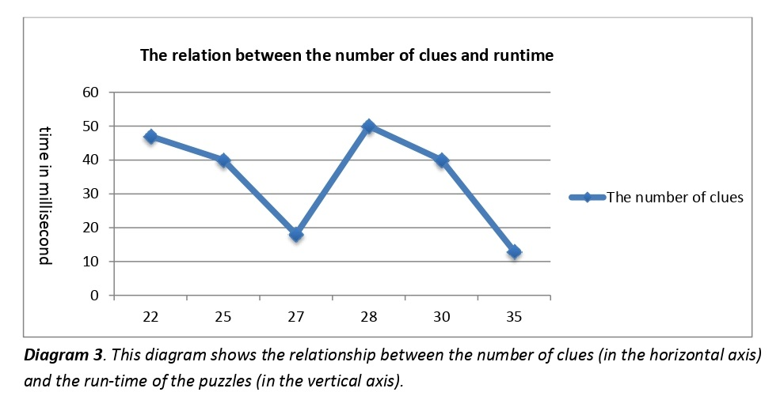

# SudokuSolvingApp
Sudoku Solving App
https://github.com/siddhanth0412/SudokuSolvingApp/blob/98ba70d756ccbf78371dd5e275a9d6a00ce66831/Sudoku%20Solver.apk

# ABSTRACT

In the last decade, solving the Sudoku puzzle has become every one’s
passion. The simplicity of puzzle’s structure and the low requirement
of mathematical skills caused people to have enormous interest in
accepting challenges to solve the puzzle. Therefore, developers have
tried to find algorithms in order to generate the variety of puzzles for
human players so that they could be even solved by computer
programming. In this essay, we have presented an algorithm called
pencil-and-paper using human strategies. The purpose is to implement
a more efficient algorithm and then compare it with another Sudoku
solver named as brute force algorithm. This algorithm is a general
algorithm that can be employed in to any problems. The results have
proved that the pencil-and-paper algorithm solves the puzzle faster
and more effective than the brute force algorithm. 

# 1. Introduction

Currently, Sudoku puzzles are becoming increasingly popular among the people all over the
world. The game has become popular now in a large number of countries and many
developers have tried to generate even more complicated and more interesting puzzles.
Today, the game appears in almost every newspaper, in books and in many websites.

In this essay we present a Sudoku Solver named as pencil-and-paper algorithm using simple
rules to solve the puzzles. The pencil-and-paper algorithm is formulated based on human
techniques. This means that the algorithm is implemented based on human perceptions.
Therefore the name of the solver is pencil-and-paper algorithm. The Brute force algorithm is
then used to compare with this algorithm in order to evaluate the efficiency of the proposed
algorithm. The brute force is a general algorithm than can be applied to any possible problem.
This algorithm generates any possible solutions until the right answer is found.

The following subsections describe the problem statement, the purpose of this project, and the
abbreviations and the definitions.

# 1.1 Problem Statement

Solving Sudoku has been a challenging problem in the last decade. The purpose has been to
develop more effective algorithm in order to reduce the computing time and utilize lower
memory space. This essay develops an algorithm for solving Sudoku puzzle by using a
method, called pencil-and-paper algorithm. This algorithm resembles human methods, i.e. it
describes how a person tries to solve the puzzle by using certain techniques. Our ambition is
to implement the pencil-and-paper algorithm by using these techniques.

There are currently different variants of Sudoku such as 4X4 grids, 9X9 grids and 16X16
grids. This work is focused on classic and regular Sudoku of 9X9 board, and then a
comparison is performed between the paper-and-pencil method and Brute force algorithm.
Hopefully, by doing this work we might be able to answer the following questions: How does
the pencil-and-paper algorithm differ from the Brute force algorithm? Which one of them is
more effective? Is it possible to make these algorithms more efficient?

# 1.2 Purpose

The aim of the essay is to investigate the brute force algorithm and the pencil-and-paper
algorithm. Later these two methods are compared analytically. It is expected here to find an
efficient method to solve the Sudoku puzzles. In this essay we have tried to implement the
pencil-and-paper algorithm that simulate how human being would solve the puzzle by using
some simple strategies that can be employed to solve the majority of Sudoku.

# 1.3 Abbreviations and Definitions

In this essay we have tried to use the same terminology, which is commonly used in other
journals and research papers. In the following paragraph, there is a brief description of some
the abbreviations and definitions that are used in the text.

Sudoku: is a logic-based, combinatorial number placement puzzle. The word “Sudoku” is
short for Su-ji wa dokushin ni kagiru (in Japanese), which means “the numbers must be
single”.

Box (Region, Block): a region is a 3x3 box. There are 9 regions in a traditional Sudoku puzzle.

Cell (Square): is used to define the minimum unit of the Sudoku board.

Candidates: the number of possible values that can be placed into an empty square.

Clues: the given numbers in the grid at the beginning.

Grid (board): the Sudoku board consists of a form of matrix or windows. 

# 2. Background

This section starts with an explanation about Sudoku. Then a research is carried out on the
previous works about this subject. Later, we discuss further about evaluated algorithms and
finally a description of how the work is being carried out is presented. 

# 2.1 Short about Sudoku

Sudoku is a logic-based puzzle that is played by numbers from 1 to 9. The Puzzle first
appeared in newspapers in November 1892 in France and then Howard Garns an American
architect presented it in its modern form [1,5]. There are already many journals, papers and
essays that researched about Sudoku Solvers and most of them present different type of
algorithms. Sudoku’s popularity is based on several reasons. First of all it is fun and
fascinating, and very easy to learn because of its simple rules. There are currently many
different type of Sudoku puzzles, classic Sudoku that contains a 9X9 grid with given clues in
various places, mini Sudoku that consists of a grid with 4X4 or 6X6 sizes. The other type of
Sudoku is Mega Sudoku that contains a grid with 12X12 or 16X16 sizes [2]. In this text, the
focus is mostly on the classic Sudoku, i.e. 9X9 grid. Furthermore, Sudoku has become so
popular, compared to other games, all over the world because its rules are easy to understand
and it can improve our brain and also it is fun.

The structure of the puzzle is very simple, especially the classic puzzle. This essay is mainly
focused on classic puzzle of a 9X9 grid. There already exist a number of digits in the board
that make the puzzle solvable. It means that some numbers are already placed in the Sudoku
board before starting playing. The board consists of 81 cells, which is divided into nine 3X3
sub boards and each 3X3 sub board is called “box” or “region”. The main concept of the
game is to place numbers from 1 to 9 on a 9X9 board so that every row, column and box
contains any numbers but once. This means that no number is repeated more than once. An
example of this game is illustrated in Fig.1.

Generally, the puzzle has a unique solution. There are certain techniques to solve the puzzle
by hand and these rules can be implemented into a computer program. These techniques are
presented in more details in 2.3.

# 2.2 Previous Research

We have noticed that there is a large volume of published studies describing Sudoku
problems. Furthermore, several research have been made to solve Sudoku problems in a more 
efficient way. It has conclusively been shown that solving the puzzle, by using different
algorithms, is definitely possible but most developers seek for optimizations techniques such
as genetic algorithms, simulated annealing, etc.

Different authors have made relative works already. Nelishia Pillay gives a solution for
solving Sudoku by combining human intuition and optimization. This author has
investigated the use of genetic programming to improve a space of programs combined of the
heuristics moves. However, we seek a solution to solve Sudoku puzzle based on human
strategies, which uses techniques such as: naked single method, hidden single method etc.
J.F. Crook have also discussed about solving Sudoku and presented an algorithm on how to
solve the puzzles of differing difficulty with pencil-and-paper algorithm. This method has not
been implemented and therefore it is hard to discuss how the algorithm performs. Tom
Davis has done a research about “The Mathematics of Sudoku”. Tom has described all
techniques that people usually use to solve the puzzles but his major attempt is to describe
these techniques from mathematical perspective. However, all the strategies he mentions are
not required to solve the puzzle. For instance the easy puzzles can be solved using only one or
two strategies.

# 2.3 Examined algorithms

# 2.3.1 Pencil-and-paper algorithm

In this work, we implement a solution based on some strategies used by humans when solving
the puzzle, therefore, it is called pencil-and-paper algorithm.

The paper-and-pencil algorithm contains human strategies. These strategies have been
examined below in more details. These techniques are almost easy to understand by human
players, but it might be hard to search in the puzzle, since there are several things to look for
at the same time. As there are puzzles with different types of difficulty, the easy and medium
puzzles can be solved using some simple techniques such as unique missing method, naked
singles. However to solve difficult problems we may examine other techniques as well
(locked candidates, naked and hidden pairs, triplets etc.).

# Unique missing candidate

The unique missing candidate is used when any row, column or box is missing only one
single digit.

# Naked Singles
This method is useful when we find a square that can only take one single value, once the
contents of other squares in the same row, column and box are considered. Additionally, this is when the row, column and box hold 8 different numbers and one single number is left for that square, see Fig. 2.

As we see in figure 2, it is possible to list all the candidates from 1 to 9 in each unfilled
square, i.e. square 4b can only hold number 2 since it is the only candidate for this position.
The most significant aspect is that when a candidate is found for a certain position then it can
be removed from the list as a possible candidate in the row, column and box [7]. The reason
that it is called the “naked single” method is that this kind of square contains only one
possible candidate.

# Hidden Singles

The hidden single method is similar to the naked single method but the way to find the way to
find the empty square is different. When there is only one square in the row, column or box
that can take a certain number, then the square must take that number. For example in figure
3, we can see that both row2 and row3 contain the digit 9 so according to the rules, row1 must
also hold number 9 (in the square 123def). In the right side of figure 3 below, number 9 is
inserted by using the hidden singles method. 

# Locked candidate

Tom Davis has stated that it is possible to find a box where the only place for a candidate
would be a row or column within that box [7]. If a candidate belongs to a row or column then
we can remove this candidate as a possible one with other boxes that the row (or column)
connected with them. This condition is shown in figure 3. The box 456abc must hold a 9 and
the only positions the number can be placed are in squares 5a or 5c and both in the same row.
This means that the number 9 is eliminated in row 5 from other boxes that include row 5.

# Naked Pairs, Triplets

These techniques are very similar to the naked single technique, but in this method we find
the same two candidates in two squares. By using this information we can find a possible
candidate to other squares. For example in figure 4, squares 9d and 9f can only contain values
2 and 7. By having this knowledge, it is obvious that square 9d and 9f cannot contain 1 or 6 so
those candidates are removed. The only candidates are 2 and 7 in squares 9d and 9f.

# 2.3.2 Brute force algorithm

Kovacs describe some of the brute force methods used for solving Sudoku puzzles. The
simplest method randomly produces a solution to the puzzle called “unconstrained grid”, after
that the program checks whether it is a valid solution. If not, the process is repeated until a
solution is found. This algorithm can be applied simply and will find a valid solution for any
problems because it will go through all possibility solutions. However, this method can be
time consuming but according to Kovacs the algorithm can be optimized.

Generally, the brute force algorithm goes through the empty squares, filling in numbers from
the existing choices, or removing failed choices if a “dead-end” is reached. For example,
Brute force solve a puzzle by inserting the digit “1” in the first square. If the digit is allowed
to be there by checking row, column and box then the program go to the next square, and put
the digit “1” in that square. The program discovers that the “1” is not allowed, then the digit
increments by one i.e. it has become 2. When a square is noticed where none of the digits (1
to 9) is permitted, then the program backtracks and comes back to the prior square. The value
in that square increases by 1. The process is repeated until the correct digits fill all 81 squares.

# 2.4 Approach

Here we carried out a study on how to solve Sudoku puzzle based on the pencil-and-paper
algorithm. The concept of this work is to implement a solution to solve the puzzle based on
human strategies. The obtained results are compared with a well-known algorithm called
Brute force algorithm that are presented in chapter 3. The final result and conclusions are
presented in chapter 4.

# .3 Analysis and Results

This section starts with analysis and discussions about two mentioned algorithms. A
comparison is carried out between two algorithms in order to find out which algorithm is
more efficient. At the end of the section, there are discussions on difficulty level of the
puzzles and time complexity.

# 3.1 Pencil-And-Paper Solver

There are several methods that are used by human players when playing Sudoku. However, it
may be impossible to implement all these methods. It is found that the hidden single method
or pair method are difficult to be applied in computer programming, since a human player has
a better overview over the whole Sudoku board than the computer programming does. This is
due to the fact that a human player is able to scan two rows or two columns in order to check
whether a certain digit is allowed to be in an empty square in the box that is supposed to be
filled up. Implementing the above task in computer programming causes significant time
consumption.

The methods that are used in this algorithm are the following:
- Unique missing candidate
- Naked single method
- Backtracking
- 
# 3.1.1 Unique missing candidate

This method is useful when there is just only one empty square in a row, column or box. The
digit that is missing can be placed in that empty square. A similar definition is that if eight of
nine empty squares are filled in any row, column or box, then the digit that is missing can fill
the only empty square. This method can be useful when most of the squares are filled,
especially at the end of a solution. It can also be suitable when solving easy puzzle and this
method is efficient to find solution in this case. In this algorithm, the method goes through all
rows, columns and boxes separately. The method then checks if a single value has missed in
any row, column or box and place the single digit in that specific square (see the appendix).

# 3.1.2 Naked single method

The second method that is used in the pencil-and-paper algorithm is the Naked single method.
This method checks every empty square in the Sudoku board and finds the square that can
only take one single digits and the missing digit then is assigned to that square. Note that once
the squares are filled by naked single digits other naked singles will appear. This process is
repeated until the method has found all empty squares with the needed corresponding one
single value and complete the board.

This method is a useful method when a human player solves the game. However if the
corresponding method is combined with the unique missing candidate method then both the
methods can solve the puzzles both in easy and medium levels quickly and more efficiently.

# 3.1.3 Backtracking (guessing method)

The unique missing method and the naked single method are able to solve all puzzles with
easy and medium level of difficulties. In order to solve puzzles with even more difficult levels
such as hard and evil the backtracking method has been used to complete the algorithm. A
human player solves the puzzle by using simple techniques. If the puzzle is not solvable by
using the techniques the player then tries to fill the rest of the empty squares by guessing.

The backtracking method, which is similar to the human strategy (guessing), is used as a help
method to the pencil-and-paper algorithm. In other words, if the puzzle cannot be filled when
using the unique missing method and the naked single method, the backtracking method will
take the puzzle and fill the rest of empty squares. Generally, the backtracking method find
empty square and assign the lowest valid number in the square once the content of other
squares in the same row, column and box are considered. However, if none of the numbers
from 1 to 9 are valid in a certain square, the algorithm backtracks to the previous square,
which was filled recently.

The above-mentioned methods are an appropriate combination to solve any Sudoku puzzles.
The naked single method can find quickly single candidates to the empty squares that needed
only one single value. Since the puzzle comes to its end solution the unique missing method
can be used to fill rest of the puzzles. Finally, if either method fills the board the algorithm
calls the backtracking method to fill the rest of the board.

# 3.2 Brute Force Solver

The second algorithm that is examined in this work is Brute force algorithm. Usually, the
brute force algorithm can be applied to any possible algorithm. For example when finding
password, the algorithm generates any possible password until the right one is found. In this
case the algorithm goes through every empty square and places a valid digit in that square. If
no valid number is found the algorithm comes back to the previous square and change the
value in that square. The process is repeated until the board is filled with numbers from 1 to 9.

The advantage of the brute force algorithm is that the algorithm can guarantee a solution to
any puzzles since it generates all possible answers until the right answer is found if the
puzzles are valid [9]. Additionally, the running time can be unrelated to level of difficulty,
because the algorithm searches for every possible solution.

In order to compare the pencil-and-paper algorithm with the brute force algorithm a (preimplemented) brute force algorithm has been used during testing [10].

# 3.3 Comparing

In this section we present the result of the testing and also examine the differences between
the pencil-and-paper algorithm and the brute force algorithm.

The proposed algorithm has proved that is able to solve Sudoku puzzle with any levels of
difficulty. We have assumed to have four levels of difficulty during testing. These levels are;
easy, medium, hard and evil (challenging). This algorithm is able to solve the easy and
medium puzzle without using backtracking method (less than 20 ms). In order to solve the
puzzles with more difficult level such as hard or evil the algorithm uses the backtracking
method as well. During testing we have noticed that the given algorithm performs better than
the brute force algorithm in the term of the runtime (the time the algorithm takes to be
executed). The diagram-1 below shows the differences between these two algorithms. Note
that the puzzles, which are used in the testing, are taken from a valid webpage [11]. The
webpage generates Sudoku puzzles with different ratings.

This diagram depicts the differences between the pencil-and-paper algorithm and the brute
force algorithm based on how long it takes to solve the puzzles by a computer. The penciland-paper algorithm solves the puzzle quicker than the brute force algorithm. The given data
is based on the averaging of the computing time for several puzzles that have been tested with
the same difficulty levels such as easy, medium, hard, and evil respectively. For instance the
time obtained for the easy level is the result of averaging several computing times with easy
level. In the given diagram the vertical axis represents running time of the puzzles in
milliseconds and the horizontal axis the difficulty levels.

Generally, the backtracking method, which is similar to the brute force algorithm, can solve
the puzzles quicker than the pencil-and-paper algorithm. The question now is why should we
use backtracking and human methods together? There are three reasons to do so. Firstly, the
purpose of this work is to implement an algorithm applying human strategies. Secondly,
human players also use the backtracking method when they get stuck. It means that players
check different alternatives and place the numbers in the empty squares by guessing when
there are no options left. Finally, employing the human strategies make the algorithm more
efficient based on the number of comparisons. In other words, the naked single method fills
the empty squares by performing fewer comparisons in short time as it uses a better
technique. However, the backtracking method runs more number of analytical circulation
while solving the puzzles resulting consumption of memory space. This can clearly be shown
in the diagram-2. The result shows that the number of comparisons in the backtracking
method is higher than when the human strategies and backtracking methods are used together.

# 3.4 The Difficulty Level of Sudoku Puzzles

The difficulty level of Sudoku puzzles depends on how the given numbers are placed in the
Sudoku board and also how many numbers (clues) are given. Generally, the most significant
aspect of difficulty ratings of Sudoku puzzles is that which techniques are required to solve
the puzzles. In other words, it is important where the given numbers are placed logically.
The Puzzles, which needs more techniques to solve, can be named as difficult one. On the
other side there are puzzles that can be solved by using simple methods and this kind of
puzzles can be defined as easy or medium level. As mentioned above, there are four difficulty
levels that are used in testing (easy, medium, hard and evil). We have found during testing
that the classifications of difficulty levels is not easy as it is stated. This is due to the fact that
there have been puzzles which marked as hard level but they had been solved using simple
techniques and vice versa.

There are people who believe that the difficulty ratings have to do with the number of
revealed numbers on the puzzle board. Generally, a Sudoku puzzle needs at least 17 clues to
be solvable. It means that solving a Sudoku puzzle with 17-clues is more difficult than a
puzzle with 30-clues. More given numbers, the easier and quicker the solution is. This
statement may not be always truth, since the testing has shown that the puzzles with fewer
clues could be solved in shorter time than the puzzles with more clues. The diagram 3 below
describes the relation between the number of clues in the puzzles and their run-time. It is
might be expected that if the number of clues become more the run-time of solving the puzzle
would be shorter. For instance, when solving the puzzle with 28 clues the solving time
increases rapidly. The reason is that the puzzle needs more techniques to solve it or the
algorithm needed to iterate as long as the solution is found. 

# 3.5 Time complexity

Time complexity of an algorithm describes the time that is needed to run on a computer and it
is commonly expressed using with O notation. One way to estimate time complexity is to
count the number of operations achieved by the algorithm. Since the performance time can be
changed with different inputs of the same size we use the worst-case time of complexity,
denoted as T(n). A recent study by Kovacs showed that the worst-case complexity is related
to the difficulty of the hardest puzzle.
We shall examine the time complexity of Sudoku solver. The input to a Sudoku solver is a
Sudoku board. The standard board is a 9X9 grid and both smaller and larger boards are used.
Theses types of puzzles with small sizes can be solved quickly and faster by computer, but
only because this is small for a computer. Solving Sudoku is one of NP-complete problems
and it says that Sudoku algorithms do not scale well to larger boards and puzzles, for example
10000X10000 grids is not feasible. If the size of input to Sudoku solver goes to infinity the
time of complexity will increase exponentially. However, when solving the puzzles with
limited input size such as 9X9 grids it is feasible because they can be solved in polynomial
time.

# 4 Conclusions

This study has shown that the pencil-and-paper algorithm is a feasible method to solve any
Sudoku puzzles. The algorithm is also an appropriate method to find a solution faster and
more efficient compared to the brute force algorithm. The proposed algorithm is able to solve
such puzzles with any level of difficulties in a short period of time (less than one second).

The testing results have revealed that the performance of the pencil-and-paper algorithm is
better than the brute force algorithm with respect to the computing time to solve any puzzle.

The brute force algorithm seems to be a useful method to solve any Sudoku puzzles and it can
guarantee to find at least one solution. However, this algorithm is not efficient because the
level of difficulties is irrelevant to the algorithm. In other words, the algorithm does not adopt
intelligent strategies to solve the puzzles. This algorithm checks all possible solutions to the
puzzle until a valid solution is found which is a time consuming procedure resulting an
inefficient solver. As it has already stated the main advantage of using the algorithm is the
ability to solve any puzzles and a solution is certainly guaranteed.

Further research needs to be carried out in order to optimize the pencil-and-paper algorithm.
A possible way could be implementing of other human strategies (x-wings, swordfish, etc.).
Other alternatives might be to establish whether it is feasible to implement an algorithm based
only on human strategies so that no other algorithm is involved in the pencil-and-paper
algorithm and also make sure that these strategies can solve any puzzles with any level of
difficulties. 

# 5 References

1) Wikipedia [cited 2013 February 21], Web site: http://en.wikipedia.org/wiki/Sudoku
2) Home Of Logic Puzzles [cited 2013 February 22], Web Page:
http://www.conceptispuzzles.com/index.aspx?uri=puzzle/sudoku/classic
3) J.F. Crook, A pencil and paper algorithm for solving Sudoku Puzzles, [Cited 2013
February 24], Winthrop University, Webpage:
http://www.ams.org/notices/200904/tx090400460p.pdf
4) A.S. Showdhury, S. Skher Solving Sudoku with Boolean Algebra [Cited 2013 February
24], International Journal of Computer Applications, Peer-reviewed Research, Webpage:
http://research.ijcaonline.org/volume52/number21/pxc3879024.pdf
5) N. Pillay, Finding Solutions to Sudoku Puzzles Using Human Intuitive Heuristics, South
African Research Articles, Webpage:
http://sacj.cs.uct.ac.za/index.php/sacj/article/viewArticle/111
6) Ch. Xu, W. Xu, The model and Algorithm to Estimate the Difficulty Levels of Sudoku
Puzzles, Journal of Mathematics Research, 2009 Webpage:
http://journal.ccsenet.org/index.php/jmr/article/viewFile/3732/3336
7) T. Davis, The Mathematics of Sudoku (http://www.geometer.org/index.html), Research
Article, Webpage:
http://share.dschola.it/castigliano/ips/Documentazione%20Progetto/Materiale%20Didattico/M
atematica/1E/sudoku.pdf
8) The figures are taken from webpage:
http://www.conceptispuzzles.com/index.aspx?uri=puzzle/sudoku/techniques
9) T. Kovacs, Artificial Intelligence through Search: Solving Sudoku Puzzles, Journal Papers,
Webpage: http://www.cs.bris.ac.uk/Publications/Papers/2000948.pdf
10) Sudoku solver using brute force, visited in Mars 2013,
https://github.com/olav/JavaSudokuSolver
11) The puzzle generator, visited in Mars 2013, websudoku.com/

